# opencode-mcp

An MCP server that gives Claude Code access to fast AI coding agents — letting it delegate code generation to models running at 2,000+ tokens/sec on Cerebras while it focuses on what it's best at: planning, reviewing, and reasoning.

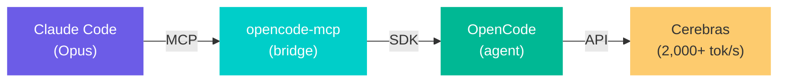

---

## Why I Built This

Claude Code is the best coding agent I've used. It plans well, catches subtle bugs, writes production-quality code, and reasons through complex architectures. But it's slow — a feature that takes Claude 5-10 minutes to generate can be drafted by a fast model in 2 seconds.

Meanwhile, fast open-source models on Cerebras (gpt-oss-120b, zai-glm-4.7) generate hundreds of lines of working code almost instantly — but they make mistakes. Operator precedence bugs, missing edge cases, security issues, rough UX. They're fast but not careful.

**The insight: these aren't competing approaches — they're complementary.**

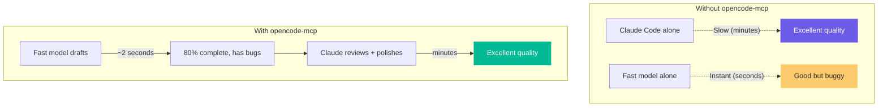

A fast model generates 80% of the code in seconds. Claude catches the bugs, fixes the security issues, and polishes the UX. You get Claude-quality output at near-Cerebras speed.

### Real Numbers

From actual testing during development:

| Task | Fast Model (Cerebras) | Claude Alone | Team (Fast + Claude) |
|------|----------------------|--------------|---------------------|
| Finance dashboard | 2s, 308 lines, 9 bugs | ~8min, 1,684 lines, 0 bugs | 2s draft + 6min polish = production quality |
| Drawing app | 1.4s, 471 lines | ~7.5min, 1,380 lines | 1.4s draft + restyle prompt = matching quality |
| Spreadsheet | 2s, 442 lines, 6 bugs | N/A | 2s draft + 1.8s fix = working app |

The fast model does the heavy lifting. Claude does the thinking.

---

## How It Works

### Architecture

Four layers, each with a clear responsibility:

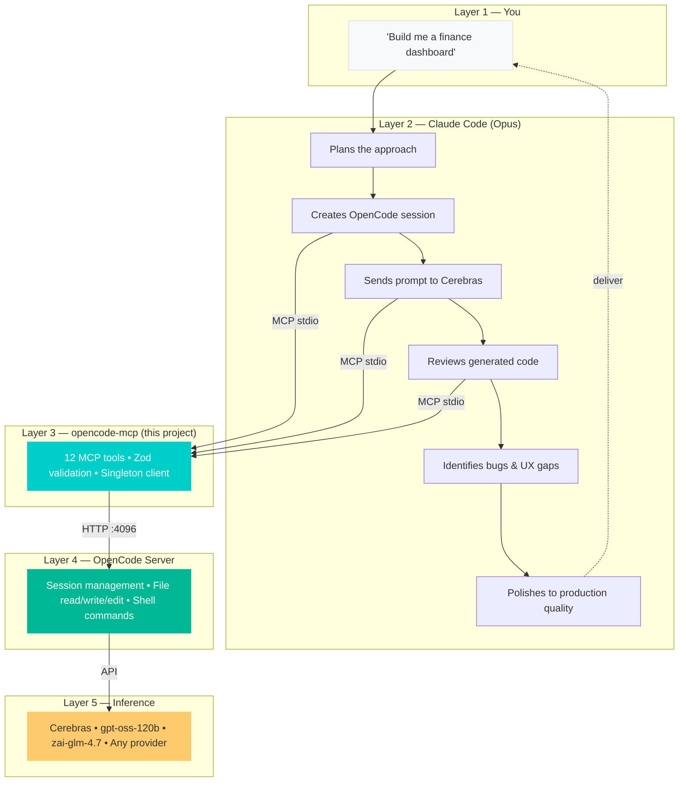

### Session Lifecycle

Sessions are the core concept — a persistent conversation with the coding agent that retains context across prompts:

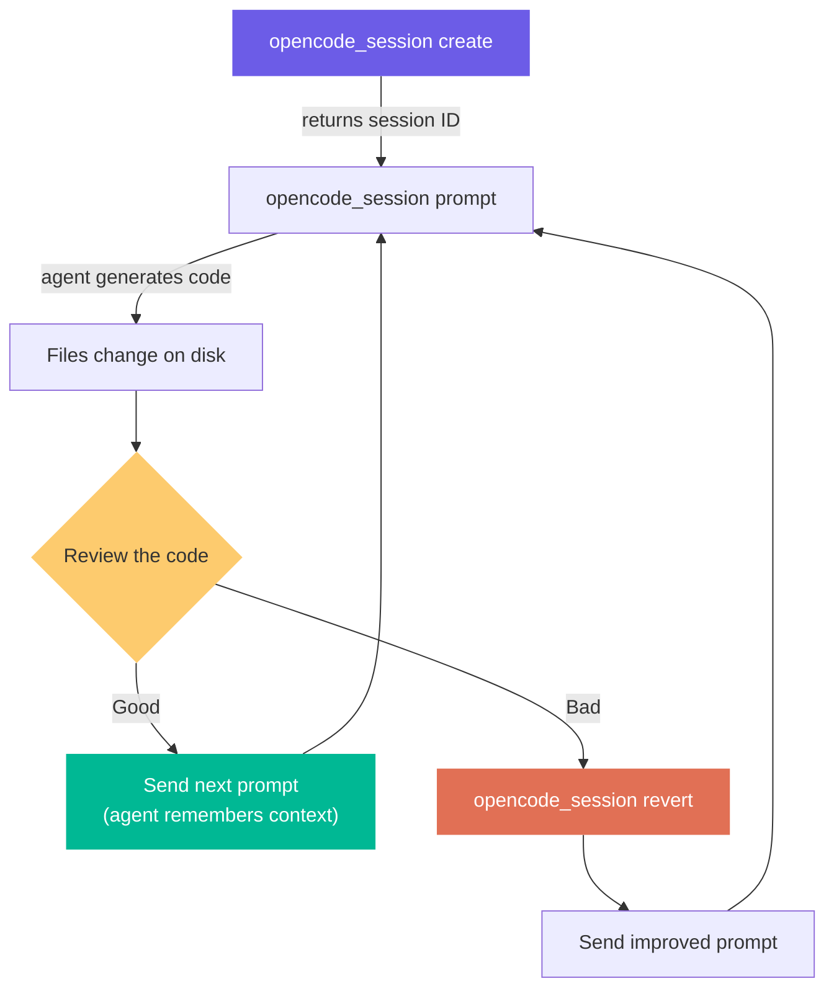

If you say "make the header blue" in prompt #3, the agent remembers what header you're talking about from prompt #1. This makes iteration fast — you don't re-explain context each time.

### Dynamic Model Switching

Change models per-prompt without touching config:

```
// Default model (from opencode.json)
opencode_session prompt → uses gpt-oss-120b

// Override for this prompt only
opencode_session prompt model="zai-glm-4.7" provider="cerebras"

// Try a different model
opencode_session prompt model="llama3.1-8b" provider="cerebras"
```

Claude picks the right model for each task — fast model for boilerplate, reasoning model for complex logic.

---

## Quickstart

### Prerequisites

- [Node.js](https://nodejs.org) 18+
- A provider API key (e.g., [Cerebras](https://cloud.cerebras.ai))

### Install

```bash
git clone https://github.com/nkulavic/opencode-mcp.git
cd opencode-mcp
cp .env.example .env   # Add your API key
npm run setup          # Installs deps, builds, verifies, configures MCP + skills
```

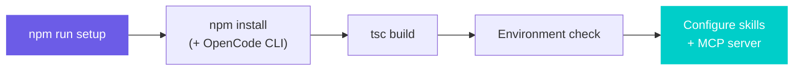

The setup script handles everything in one step:

1. **Installs dependencies** — downloads the OpenCode CLI binary for your platform via `opencode-ai`
2. **Builds the project** — compiles TypeScript to `dist/`
3. **Runs environment check** — verifies OpenCode CLI, `.env`, and build output
4. **Configures Claude Code** — prompts you to install the MCP server config + skills

You'll be asked where to install:

```
  Where would you like to install?

  1. Global (~/.claude/ — available in all projects)
  2. This project only (.mcp.json + .claude/skills/)
  3. Both
  4. Cancel
```

After setup completes, **restart Claude Code** to pick up the new MCP server.

> **Already have OpenCode installed globally?** That works too. `start.sh` checks `node_modules/.bin/opencode` first, then falls back to your global install.

### Verify It Works

After restarting Claude Code, try:

```
You: "Use opencode to create a hello world HTML file at examples/test/index.html"

Claude will:
1. Call opencode_session create → gets session ID
2. Call opencode_session prompt → sends task to Cerebras
3. Review the generated file
4. Report back
```

If Claude doesn't recognize `opencode_session`, the MCP server isn't connected. See [Managing the MCP Server](#managing-the-mcp-server) below.

---

## Managing the MCP Server

The setup script configures the MCP server automatically, but you can also add, remove, or move the config manually.

### How the MCP Config Works

Claude Code discovers MCP servers from two config files. The setup script writes to one or both depending on your choice:

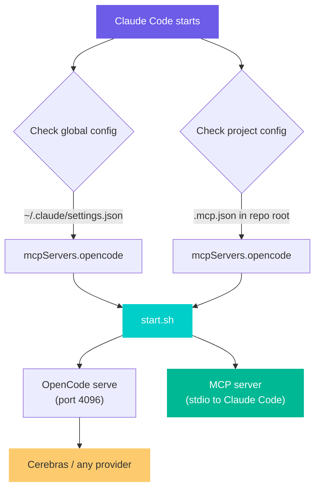

| Install type | Config file | Scope |
|---|---|---|
| **Global** | `~/.claude/settings.json` | Every Claude Code session on your machine |
| **Project** | `.mcp.json` (repo root) | Only when working in this repo |

Both files use the same format — a JSON object with `mcpServers.opencode.command` pointing to the absolute path of `start.sh`.

### Add Manually

If you skipped the setup prompt, or want to add the MCP server to a different location:

**Global** — edit `~/.claude/settings.json` and add the `mcpServers` key (keep your existing settings):

```json
{
  "permissions": { ... },
  "mcpServers": {
    "opencode": {
      "command": "/absolute/path/to/opencode-mcp/start.sh"
    }
  }
}
```

**Project** — create or edit `.mcp.json` in your repo root:

```json
{
  "mcpServers": {
    "opencode": {
      "command": "/absolute/path/to/opencode-mcp/start.sh"
    }
  }
}
```

> **Important:** The `command` must be an absolute path to `start.sh`. Relative paths won't work because Claude Code doesn't resolve them from the MCP project directory.

Restart Claude Code after editing either file.

### Remove the MCP Server

To disconnect OpenCode from Claude Code, remove the `opencode` entry from whichever config file has it:

**Global** — edit `~/.claude/settings.json` and delete the `"opencode": { ... }` block from `mcpServers`. If `opencode` was the only MCP server, you can delete the entire `mcpServers` key.

**Project** — delete `.mcp.json`, or edit it to remove the `opencode` entry.

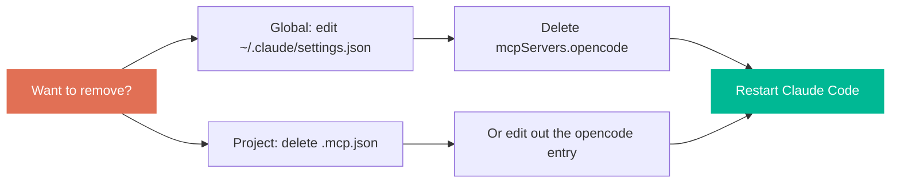

Restart Claude Code after removing.

### Move Between Global and Project

To move from global to project-only (or vice versa), run the setup script again:

```bash
npm run install-skills
```

It will detect the existing config and ask whether to overwrite. Choose your new target, then manually remove the old config from the other location.

### Troubleshooting

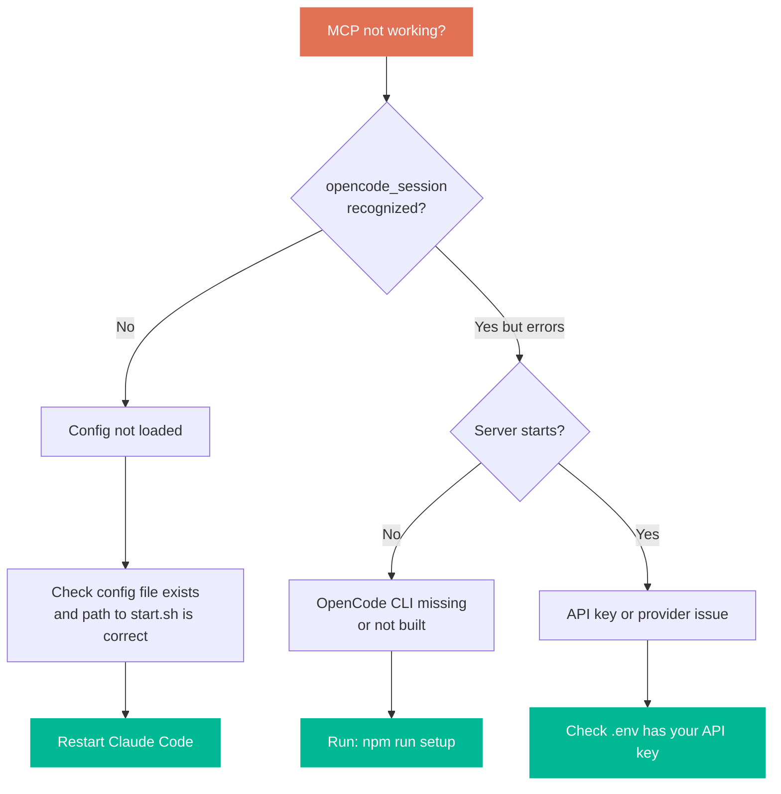

| Symptom | Cause | Fix |
|---------|-------|-----|
| Claude doesn't recognize `opencode_session` | MCP config not loaded | Check config file, restart Claude Code |
| `start.sh` errors on launch | Project not built | `npm run build` |
| `opencode not found` in start.sh | CLI not installed | `npm install` in the project directory |
| Session creates but prompts fail | API key missing or invalid | Check `.env` and provider credentials |
| Port 4096 already in use | Another OpenCode instance running | Kill it or set `OPENCODE_PORT` to a different port |

### How `start.sh` Works

`start.sh` is the entry point Claude Code calls. It handles the full server lifecycle automatically:

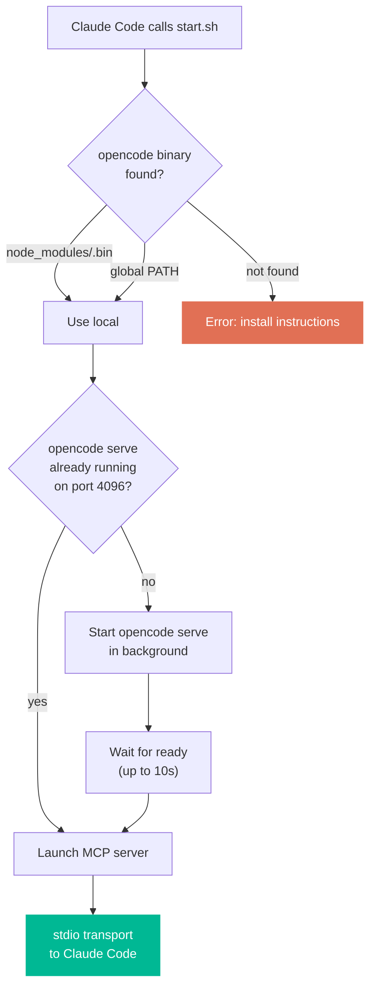

You don't need to start any servers manually. `start.sh` boots the OpenCode server on demand and connects the MCP bridge — all triggered automatically when Claude Code starts.

---

## Claude Code Skills

The project includes two optional skills (slash commands) that teach Claude how to use the MCP tools effectively.

Skills are installed alongside the MCP config during `npm run setup`, or anytime with:

```bash
npm run install-skills
```

### `/opencode` — Delegation Guidance

An always-on advisor that helps Claude decide when to delegate vs write directly.

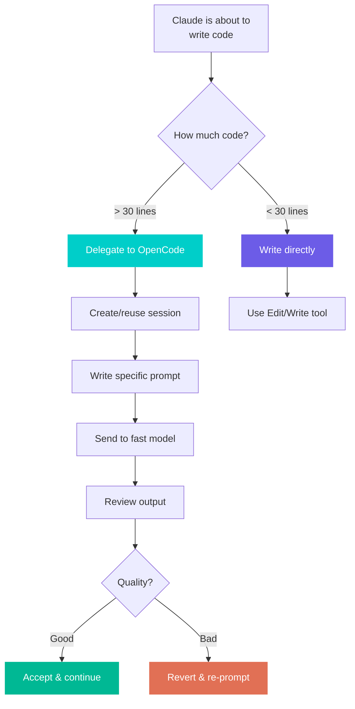

**What it provides:**
- **Decision heuristic** — delegate for new files, boilerplate, tests, scaffolding. Write directly for small edits, config, security-critical code.
- **Prompt engineering** — how to write specific prompts that produce good output from fast models.
- **Review checklist** — what bugs to look for: operator precedence, XSS, missing accessibility, timezone issues.
- **Session management** — reuse sessions, fork for alternatives, summarize long sessions.

### `/opencode-build` — Team Build Pipeline

Runs the full "fast draft + Claude polish" workflow end to end. Just describe what you want.

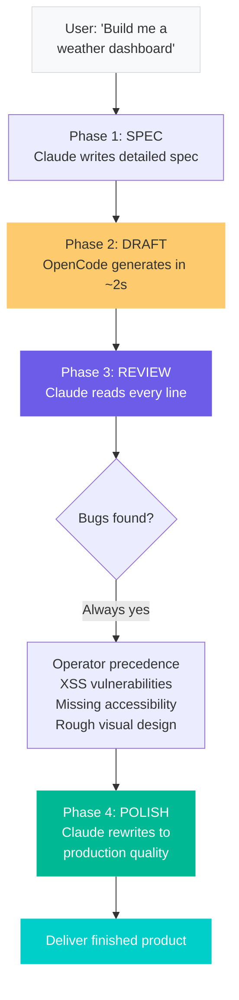

**The pipeline:**
1. **Spec** — Claude writes a detailed specification from your description
2. **Draft** — Sends to gpt-oss-120b on Cerebras (~2s generation, 300-500 lines)
3. **Review** — Claude reads every line, identifies bugs, security issues, UX gaps
4. **Polish** — Claude rewrites with animations, accessibility, responsive design, micro-interactions

---

## Tools Reference

12 tools covering the full OpenCode SDK (~62 methods across 12 namespaces).

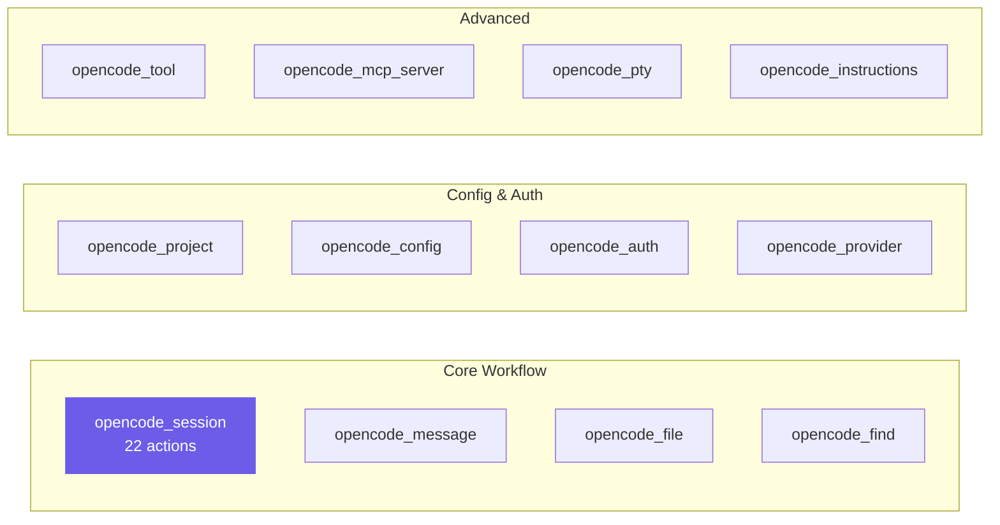

### Core Workflow Tools

| Tool | Actions | What It Does |
|------|---------|--------------|
| `opencode_session` | create, prompt, promptAsync, revert, unrevert, diff, fork, abort, summarize, + 13 more | The main tool. Create sessions, send coding tasks, review diffs, revert bad changes, fork sessions. Supports `model` and `provider` params for dynamic model switching. |
| `opencode_message` | list, get | Read the agent's conversation history. See what it did and why. Use `limit` to get recent messages only. |
| `opencode_file` | status, read, list | Check what files changed (`status`), read file contents (`read`), browse directories (`list`). |
| `opencode_find` | text, files, symbols | Search the codebase. `text` is grep, `files` finds by name, `symbols` finds functions/classes. |

### Configuration & Auth Tools

| Tool | Actions | What It Does |
|------|---------|--------------|
| `opencode_project` | current, list, agents, commands, vcs | Get project info, discover available agents, list commands, get git status/branch info. |
| `opencode_config` | get, providers, update | Read and update OpenCode configuration. |
| `opencode_auth` | set | Set provider API credentials. |
| `opencode_provider` | list, auth, authorize, callback | List providers with models and connection status. OAuth flow for providers that need it. |

### Advanced Tools

| Tool | Actions | What It Does |
|------|---------|--------------|
| `opencode_tool` | ids, list | Discover what tools the agent has available. `list` returns full JSON schema per tool. |
| `opencode_mcp_server` | status, add, connect, disconnect, + 4 auth actions | Manage MCP servers running inside OpenCode itself. |
| `opencode_pty` | list, create, get, update, remove | Manage terminal sessions within OpenCode. |
| `opencode_instructions` | *(static)* | Returns the full workflow guide. Claude can call this when it needs a refresher on how to use the tools. |

### Full Session Actions

The `opencode_session` tool has 22 actions:

| Action | Purpose |
|--------|---------|
| `create` | Start a new session. Returns a session ID. |
| `prompt` | Send a coding task. The agent generates code. Accepts `model` + `provider` for dynamic switching. |
| `promptAsync` | Send a task without waiting for completion. |
| `revert` | Undo changes from a specific message. Pass `messageId`. |
| `unrevert` | Undo a revert. |
| `diff` | See what changed. Optional `messageId` to diff a specific prompt. |
| `fork` | Fork a session at a specific message to try a different approach. |
| `abort` | Cancel a running prompt. |
| `summarize` | Get a summary of what the agent has done so far. |
| `get` | Get session details. |
| `list` | List all sessions. |
| `status` | Overall status. |
| `children` | List child/forked sessions. |
| `update` | Update session metadata. |
| `delete` | Delete a session. |
| `init` | Re-initialize a session. |
| `share` / `unshare` | Share/unshare a session. |
| `command` | Run an agent command. |
| `shell` | Run a shell command in the session. |
| `todo` | Get the session's todo list. |
| `permission` | Respond to tool permission requests (once/always/reject). |

---

## Workflows

### Basic: Delegate and Review

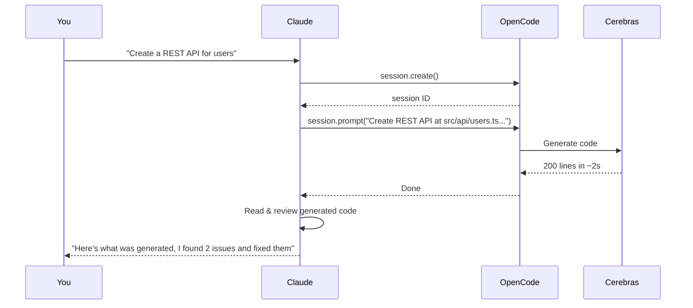

### Team: Fast Draft + Claude Polish

The most powerful pattern — used by the `/opencode-build` skill:

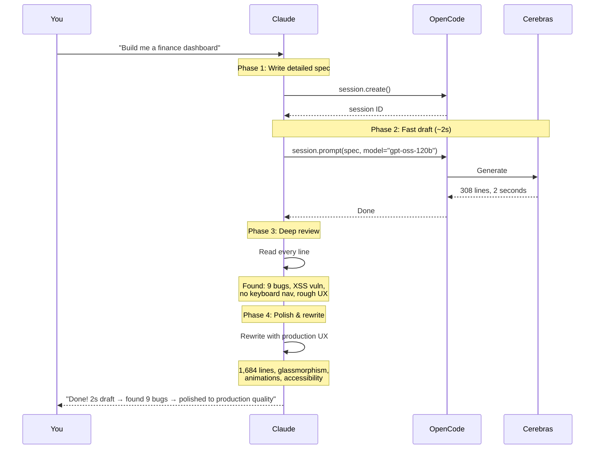

### Parallel: Multiple Models

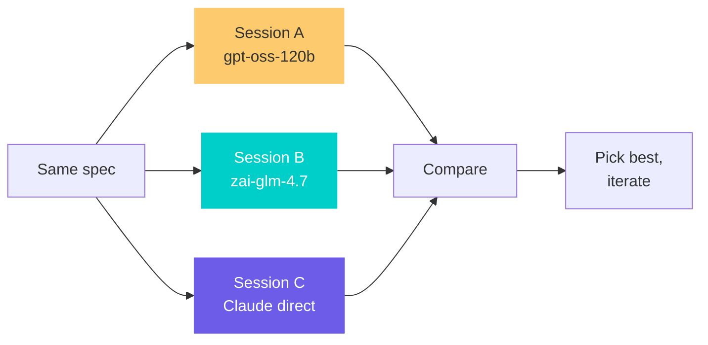

### Iterative: Rapid Refinement

Each prompt builds on session context — the agent remembers everything:

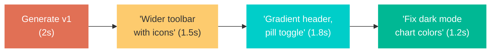

---

## Examples

The `examples/` directory contains apps built during development. Each is a single HTML file — open directly in a browser.

### How Each Example Was Built

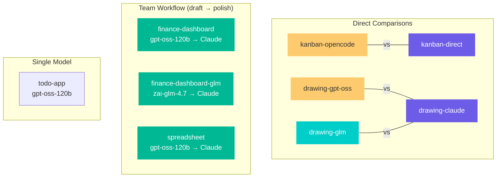

| Example | Build Method | Draft Time | Final Lines |
|---------|-------------|------------|-------------|
| `finance-dashboard/` | Team: gpt-oss-120b → Claude polish | ~2s | 1,684 |
| `finance-dashboard-glm/` | Team: zai-glm-4.7 → Claude polish | ~2.5s | 1,318 |
| `spreadsheet/` | Team: gpt-oss-120b → Claude review | ~2s | 544 |
| `kanban-opencode/` | OpenCode (gpt-oss-120b) | ~2s | — |
| `kanban-direct/` | Claude directly | ~5min | — |
| `drawing-gpt-oss/` | OpenCode (gpt-oss-120b), restyled | ~1.4s | — |
| `drawing-glm/` | OpenCode (zai-glm-4.7), restyled | ~2.3s | — |
| `drawing-claude/` | Claude directly | ~7.5min | — |
| `todo-app/` | OpenCode (gpt-oss-120b) | ~2s | — |

---

## Configuration

### `opencode.json`

Controls the default model and provider:

```json
{
  "$schema": "https://opencode.ai/config.json",
  "provider": {
    "cerebras": {}
  },
  "agent": {
    "coder": {
      "description": "Fast coding agent powered by Cerebras gpt-oss-120b",
      "mode": "primary",
      "model": "cerebras/gpt-oss-120b",
      "tools": { "read": true, "write": true, "edit": true, "bash": true }
    }
  }
}
```

You can define multiple agents with different models and select them per-prompt with the `agent` parameter.

### Environment Variables

| Variable | Description | Default |
|----------|-------------|---------|
| `CEREBRAS_API_KEY` | Cerebras API key | *(required)* |
| `OPENCODE_HOST` | OpenCode server bind address | `127.0.0.1` |
| `OPENCODE_PORT` | OpenCode server port | `4096` |

### Using Other Providers

OpenCode supports multiple providers. To use a different one, add the provider to `opencode.json`, set the API key in `.env`, and either change the default model or use dynamic switching per-prompt.

---

## Project Structure

```
opencode-mcp/
├── src/
│   ├── index.ts              # MCP server setup, tool registration, instructions
│   ├── client.ts             # OpenCode SDK client (singleton, retry logic)
│   └── tools/
│       ├── session.ts        # 22 actions — the core tool
│       ├── message.ts        # Conversation history
│       ├── file.ts           # File operations
│       ├── find.ts           # Code search
│       ├── project.ts        # Project info + VCS
│       ├── config.ts         # Configuration
│       ├── auth.ts           # Provider auth
│       ├── provider.ts       # Provider management
│       ├── tool.ts           # Tool discovery
│       ├── mcp-server.ts     # MCP server management
│       ├── pty.ts            # Terminal sessions
│       └── instructions.ts   # Static workflow guide
├── skills/
│   ├── opencode/SKILL.md     # /opencode — delegation guidance
│   └── opencode-build/SKILL.md  # /opencode-build — team build pipeline
├── scripts/
│   ├── postinstall.mjs       # Post-install environment check (inc. MCP config)
│   └── install-skills.mjs    # Unified setup: skills + MCP server config
├── examples/                  # Demo apps (open index.html in browser)
├── start.sh                   # Startup script (manages opencode serve)
├── opencode.json              # Default model/provider config
├── package.json
├── tsconfig.json
└── .env.example
```

Every tool file follows the same pattern:

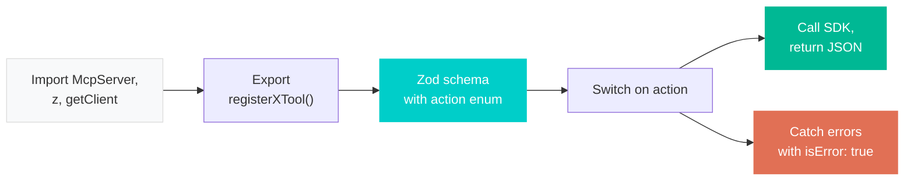

---

## Development

```bash
npm run dev            # Watch mode — recompiles on save
npm run build          # One-time build
npm start              # Run MCP server (needs opencode serve running)
./start.sh             # Run both opencode serve + MCP server
npm run install-skills # Configure MCP server + install skills for Claude Code
```

See [CONTRIBUTING.md](CONTRIBUTING.md) for details on adding tools, extending SDK coverage, and submitting examples.

## License

[MIT](LICENSE)
